# NFT Marketplace
# Cần có
## **Nodejs** version 16.0.0

### 1>`yarn`
### Lấy private key từ metamask thay vào file .env
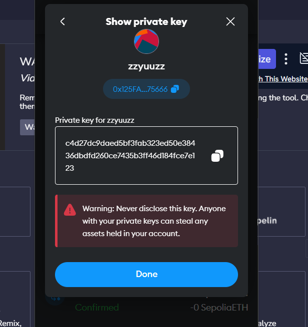
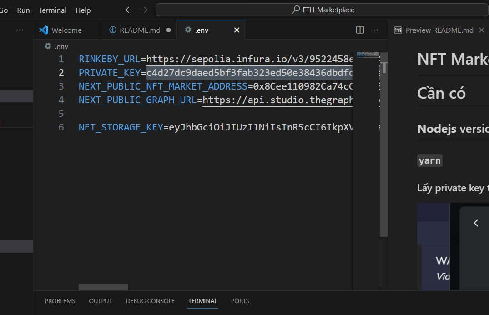
### 2>`yarn dev`
### 3>Vào localhost:3000 trên trình duyệt có ví metamask.
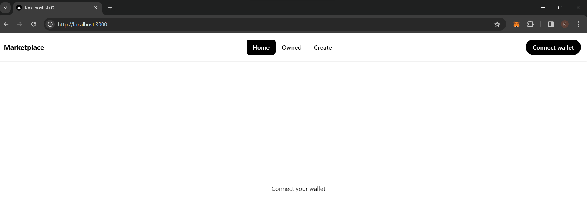
### 4>connect với ví metamask 
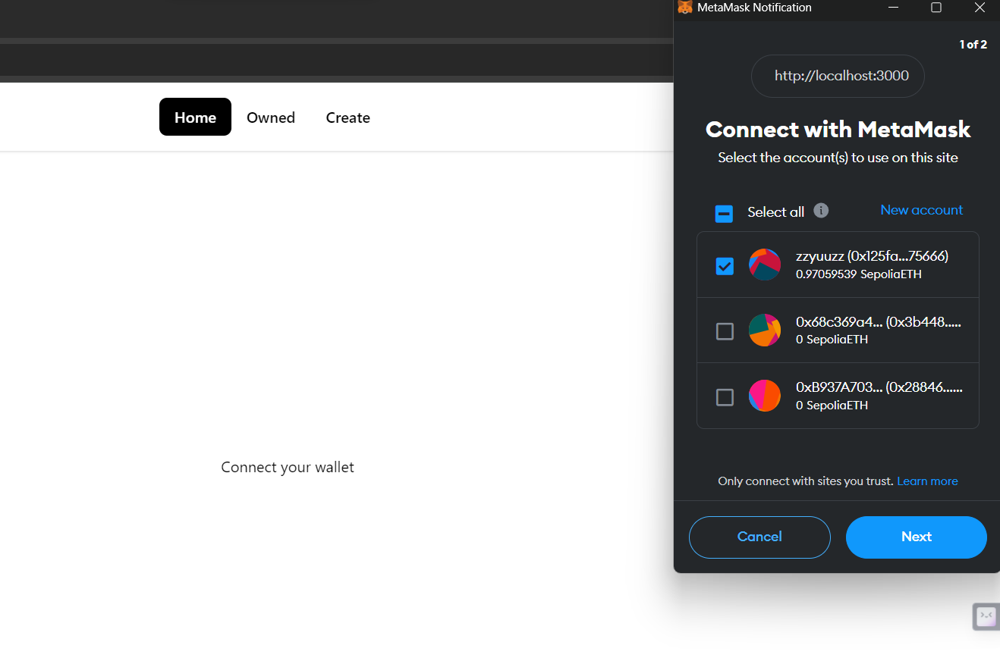
### 5>chức năng tạo 1 NFT 
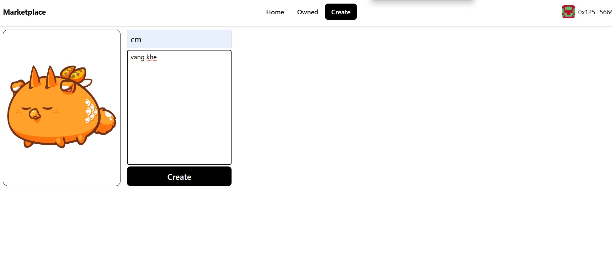
### xác nhận tạo NFT
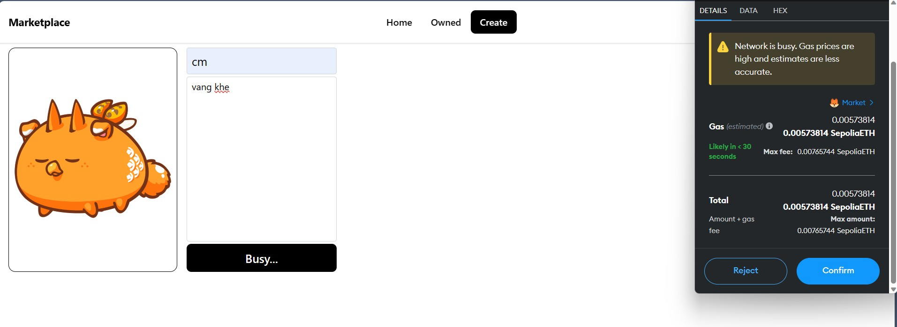
### xem danh sách các nft đang sở hữu
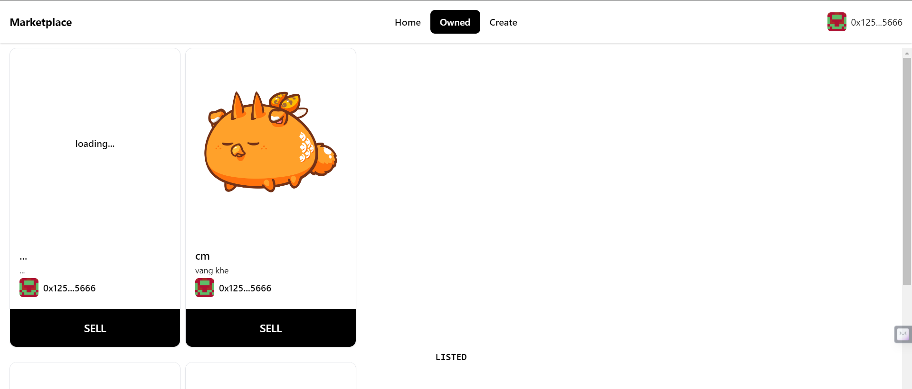
### 6>chức năng bán nft
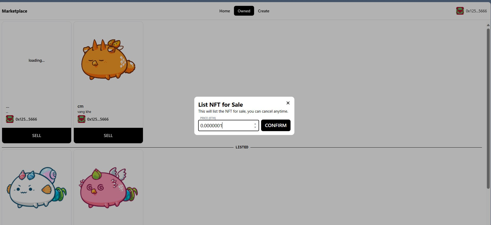
### xác nhận
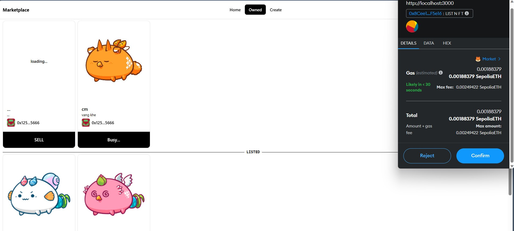
### kết quả
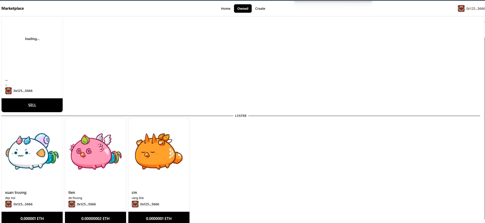
### 7>Xem nft từ ví khác
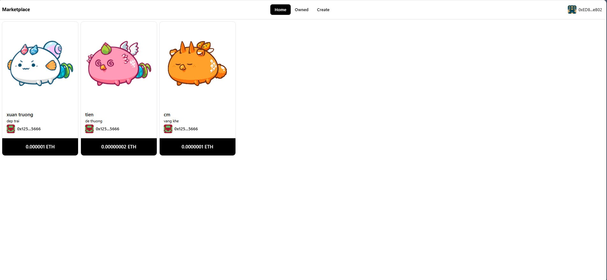
### 8>Mua NFT
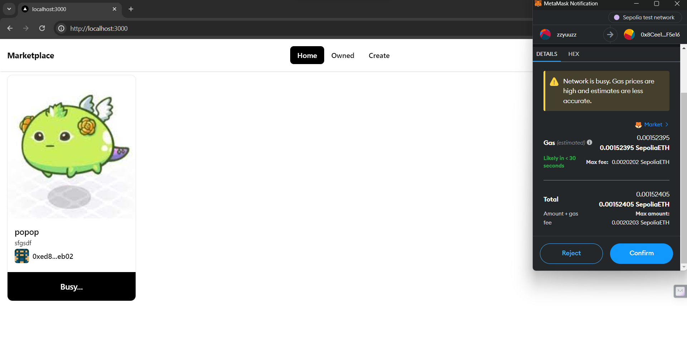
### Kết quả
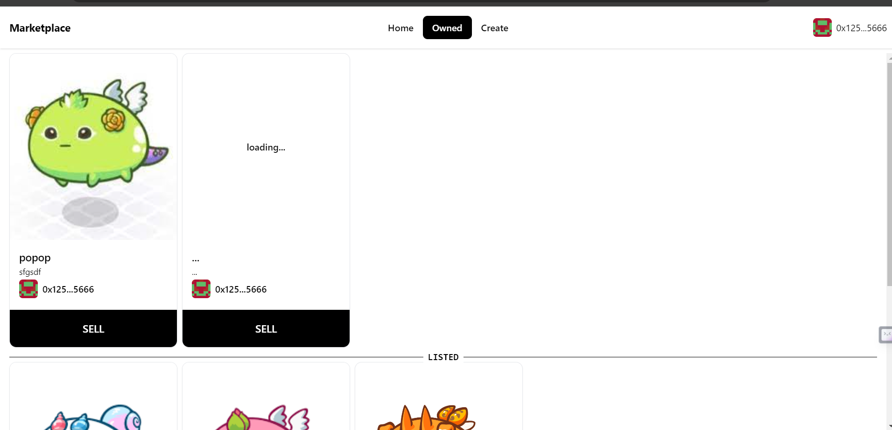